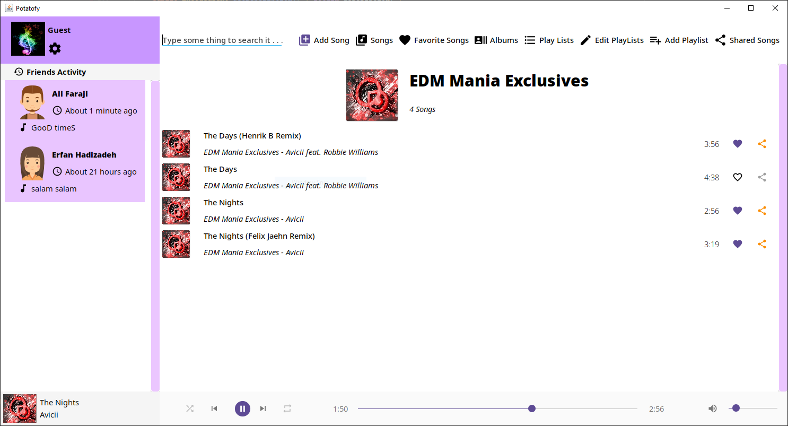
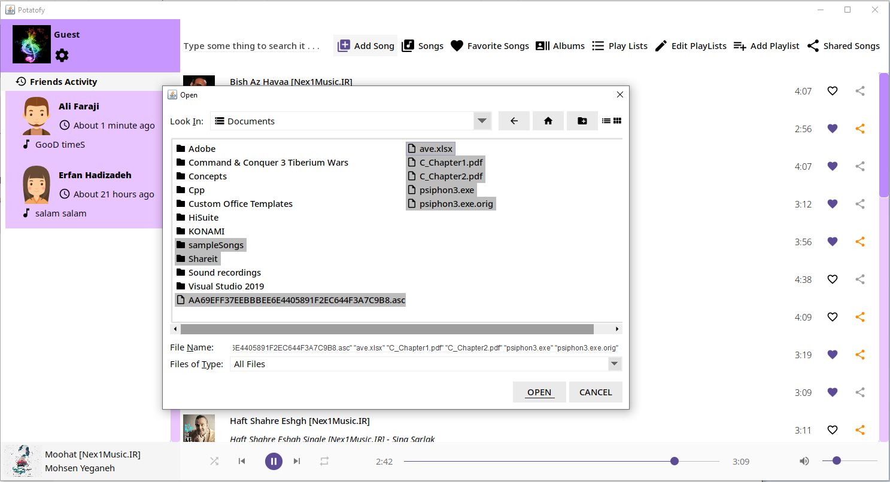

# Advanced Programming Course Project (Spring 2019)
## Jpotify
This is our **java** project for _AP course_.

We are:
 * Ali Faraji
 * Erfan Hadizadeh
 
### Dependencies:
 * Maven:
    * com.github.jiconfont:jiconfont-swing:1.0.0
    * com.github.jiconfont:jiconfont-google_material_design_icons:2.2.0.2
 * JAR Files:
    * jar files are in src
    
## Screenshots :

_Songs:_

_Albums:_

_Album:_

_Create and add PlayList:_

_Playlists:_

_Add Songs (It searchs recursively and adds mp3 files):_

## incompleted sections :
   * search : We should use similarity algorithms to search in songs title (this helps find misspelling text)
   * network: This section's backend isn't completed....see todo(s) in project.
